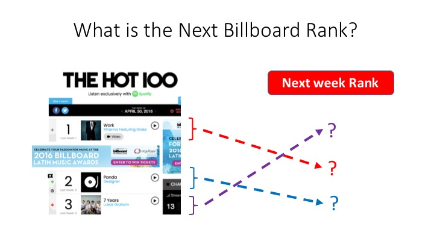
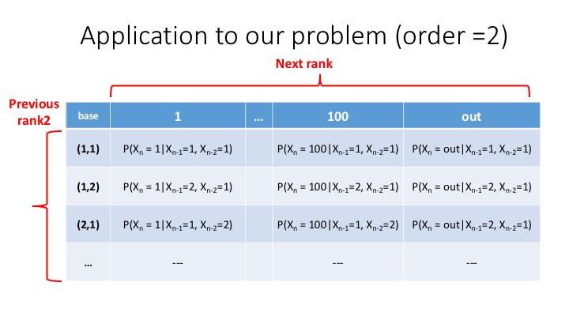

```python
from IPython.display import Image
```

# Estimation of Billboard hot 100 rank


```python
Image(filename="../images/Billboard_Hot_100_logo_1.png")
```


# Intoroduction

Digital downloaded music began to be more popular than physical recordings in the first decade of 21th century, but much of them were illegally downloaded. Legal digital downloaded music bacame widely avaialble since 2003 when Apple's iTune came out [Wilipedia Reference]. After 2010, more music retailor like Pandora and Amazon join music business. In such a situation, pricing and buying music copyright becomes more important. Popularity of songs could be one of factors to price song's copyright. In this project we define a popularity of songs and analyze the popularity future trend.  

# Objective

In this project, we define Billboard Hot 100 ranks as one of metrics for poplulairity of songs. Based on information of past Billboard Hot 100 ranks and twitter information, we are going to estimate future rank.


```python
Image(filename="../pres_jpg/Slide02.jpg")
```





We use the pattern of Billboard hot 100 rank and the information of twitter to estimate the next Billboard Hot 100 rank. 


```python
Image(filename="../pres_jpg/Slide03.jpg")
```


# Data Collection

We have the two kind of data: Billboard Hot 100 rank and Twitter. For Billboard Hot 100 rank, we collect information of rank from 1990-01-01 to 2016-4-23. The data size is 137,300 with variables of song's title, artist, rank, and date.


```python
Image(filename="../pres_jpg/Slide05.jpg")
```


For twitter data, we collected twitter information from 2016-4-3 to 2016-4-23. The song's title and artist are used as keys to search twitter. The number of tweets in this analysis are 109,410.


```python
Image(filename="../pres_jpg/Slide06.jpg")
```


For twitter data, we collected twitter information from 2016-4-3 to 2016-4-23. The song's title and artist are used as keys to search twitter. The number of tweets in this analysis are 109,410.

# Project pipeline

We collect Billboard Hot 100 and analyze pattern of series of rank. Twitter data is collected and utilized to get features. we build a model and update every week.


```python
Image(filename="../pres_jpg/Slide04.jpg")
```


## Modeling process

The first model is set up to analyze the pattern of Billbaord Hot 100 rank. The second model is set up to estimate next rank with features in twitter information and the result of the first model.


```python
Image(filename="../pres_jpg/Slide17.jpg")
```


# Model for pattern of Billboard hot 100 ranks

From the series of ranks, we find the pattern with them.


```python
Image(filename="../pres_jpg/Slide07.jpg")
```


## Markov Chain Model

We are going to apply Markov Chain to find the pattern of the series of rank.


```python
Image(filename="../pres_jpg/Slide08.jpg")
```


## How to apply Markov Chain to our problem

First we set up Markov Chain model with order = 1. In this Model, the next rank is determined by the last one rank.


```python
Image(filename="../pres_jpg/Slide09.jpg")
```


We set up Markov Chain model with order = 2. In this Model, the next rank is determined by the last two ranks.


```python
Image(filename="../pres_jpg/Slide10.jpg")
```





With the same logic, we can set up Markov Chain model with order = m for any m.

## Data management for Markov Chain Model with order =1

The data with the type of a series of rank are needed to be transformed to apply Markov Chain Model with order = 1. 


```python
Image(filename="../pres_jpg/Slide11.jpg")
```


The data with the type of a series of rank are needed to be transformed to apply Markov Chain Model with order = 2. 


```python
Image(filename="../pres_jpg/Slide12.jpg")
```


With the same logic, we can transform data of a series of rank for higher order = m where  m = 3,4,...

## Computation of probability in Markov Chain Model

After data management, we need to compute the probability in Markov Chain Model of order = m where m = 1,2,... .
Maximum likelihood estimation is used to find the probability.


```python
Image(filename="../pres_jpg/Slide13.jpg")
```


## The best order in Markov Chain Model

So far we introduce Markov Chain model with order = m, m = 1, 2, 3, .... . Which model among these models should be applied for Billboard Hot 100 ranks?. That is, which order is best for Billboard Hot 100 ranks. We use train and test set technique to answer it. Data from 1990-1-1 to 2009-12-31 is used for train set and data from 2010-1-1 to 2016-4-23 is used for test set.


```python
Image(filename="../pres_jpg/Slide14.jpg")
```


### Result of model performance in train set and test set 

The Markov Chain Model with order = 2 has the smallest MSE on the test set.


```python
Image(filename="../pres_jpg/Slide15.jpg")
```


## Second model : Model after Markov chain model is applied

From the analysis of Markov chain model, we knew that MSE for the test set in Markov chain model is around 10. The second model is introduced to reduce the mse. Strategy for the second mode is to use features in twitter data


## Feature Engineering in twitter

After we find tweets with keys of song's title and artist, we will apply natural language processing to the content of tweets


```python
Image(filename="../pres_jpg/Slide18.jpg")
```


## Sentiment analysis process on tweets 

We sketch out the process of sentiment analysis on tweets.


```python
Image(filename="../pres_jpg/Slide19.jpg")
```


## Sentiment Analysis Example

We apply sentiment analysis to 10,035 tweets for the song of "work" by the artits of "Rihanna" over 2016-4-17 through 2016-4-23. The algorithm of TextBlob is used for this sentiment analysis. The algorithm gives values between -1 and 1 to each tweet's content. Negative number means negative emotion, positive number means positive emotion, and zero means neural emotion. For this example, 41%, 53%, and 6% of tweets belong to positive emotion, neural emotion, and negative emotion, respectively. 


```python
Image(filename="../pres_jpg/Slide20.jpg")
```


## Important Feature in twitter 

We use Random Forest to find features'importance. The first estimation by Markov chain model has 98% in feature importance. Only 2% in feature importnace is for features in twitter. We provide the picture which show the importance of twitter features. Favorate rate and the number of tweets per hour have the most and second most importance. 


```python

```


```python
Image(filename="../pres_jpg/Slide21.jpg")
```


## Result

The application of the first Model and the second Model give 0.8758 R2 in cross-validation with k = 5.


```python
Image(filename="../pres_jpg/Slide22.jpg")
```


# Future project

We will analyze long effect of twitter.


```python

```


```python

```
